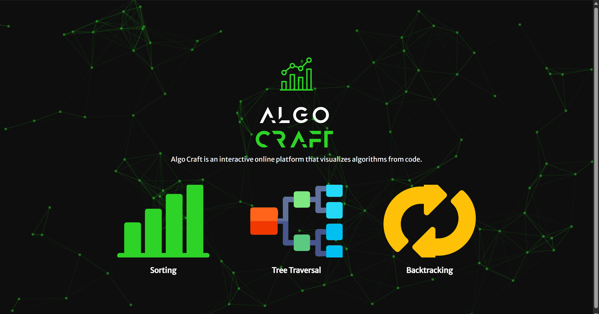
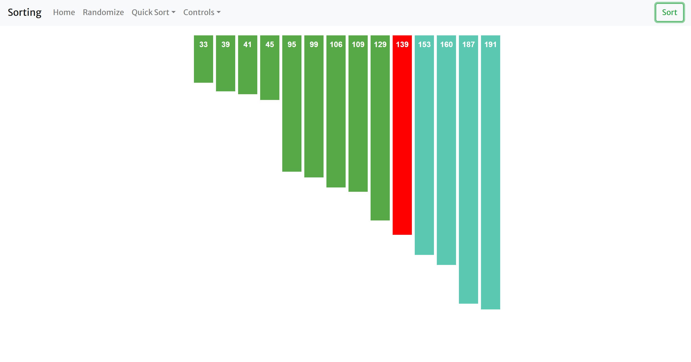
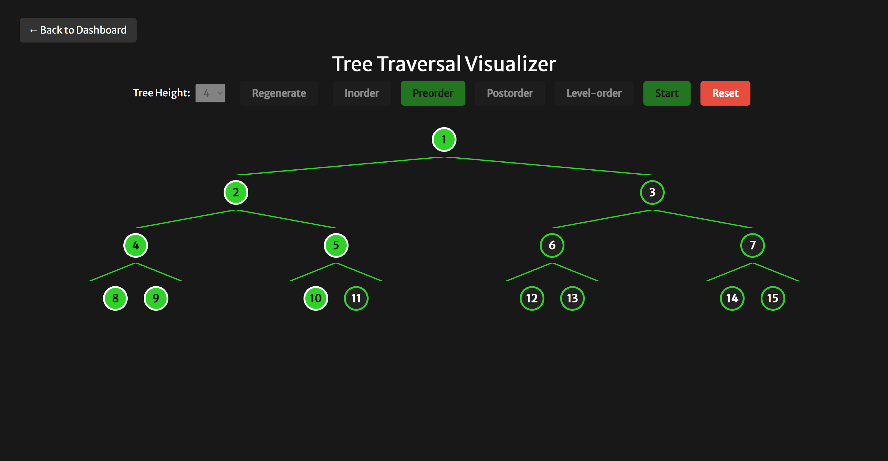
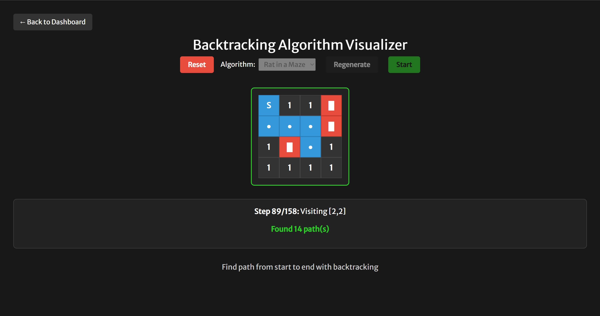

# Algo Craft

A modern, interactive algorithm visualizer built with React. Visualize and understand classic algorithms with beautiful animations and a unified UI.

---

## 🚀 Features

- **Sorting Visualizer**
  - Selection Sort
  - Merge Sort
  - Quick Sort
- **Tree Traversal Visualizer**
  - Inorder, Preorder, Postorder, Level-order (BFS)
  - Animated, recursive tree rendering
- **Backtracking Visualizer**
  - N-Queens (all solutions, animated)
  - Word Search (custom word, full backtracking trace)
  - Rat in a Maze (all possible paths, animated)
- **Dashboard** for easy navigation

---

## 🖼️ Visuals

### Dashboard


### Sorting Visualizer


### Tree Traversal Visualizer


### Backtracking Visualizer


---

## 🛠️ Installation & Usage

1. **Clone the repository**
   ```sh
   git clone <your-repo-url>
   cd algocraft
   ```
2. **Install dependencies**
   ```sh
   npm install
   ```
3. **Start the development server**
   ```sh
   npm start
   ```
4. **Open your browser** and go to [http://localhost:3000](http://localhost:3000)

---

## 👤 Author

This project is maintained and customized by **Sarvesh Dhule**.

---

Enjoy exploring algorithms visually!
