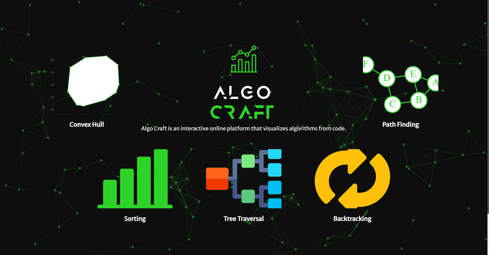

# Algo Craft

A modern, interactive algorithm visualizer built with React. Visualize and understand classic algorithms with beautiful animations and a unified UI.

---

## 🚀 Features

- **Sorting Visualizer**
  - Selection Sort
  - Merge Sort
  - Quick Sort
- **Tree Traversal Visualizer**
  - Inorder, Preorder, Postorder, Level-order (BFS)
  - Animated, recursive tree rendering
- **Backtracking Visualizer**
  - N-Queens (all solutions, animated)
  - Word Search (custom word, full backtracking trace)
  - Rat in a Maze (all possible paths, animated)
- **Convex Hull Visualizer**
  - Graham Scan algorithm
  - Interactive point placement
  - Real-time hull construction
- **Pathfinding Visualizer**
  - Dijkstra's Algorithm (4-directional, shortest path)
  - A* Search Algorithm (8-directional, heuristic-based)
  - Interactive grid with obstacles
  - Path cost calculation and visualization
- **Modern Dashboard** with intuitive navigation

---

## 🖼️ Visuals

### Dashboard


### Sorting Visualizer


### Tree Traversal Visualizer


### Backtracking Visualizer


### Convex Hull Visualizer


### Pathfinding Visualizer


---

## 🛠️ Tech Stack

- **Frontend Framework:** React.js
- **UI Library:** Material-UI
- **Animation Library:** Framer Motion
- **Routing:** React Router
- **Styling:** CSS3 with custom animations
- **Primary Language:** JavaScript (ES6+)
- **Build Tool:** npm

---

## 🎯 Key Algorithms Implemented

### Sorting Algorithms
- **Selection Sort:** O(n²) - Simple comparison-based sorting
- **Merge Sort:** O(n log n) - Divide and conquer approach
- **Quick Sort:** O(n log n) average - Pivot-based partitioning

### Tree Traversal
- **Inorder:** Left → Root → Right
- **Preorder:** Root → Left → Right  
- **Postorder:** Left → Right → Root
- **Level-order:** Breadth-first traversal

### Backtracking
- **N-Queens:** Find all valid queen placements
- **Word Search:** Find words in 2D grid
- **Rat in a Maze:** Find all possible paths

### Pathfinding
- **Dijkstra's Algorithm:** Shortest path on weighted/unweighted grids (4-directional)
- **A* Search:** Heuristic-based shortest path (8-directional with Euclidean distance)

### Computational Geometry
- **Graham Scan:** Convex hull construction

---

## 🛠️ Installation & Usage

1. **Clone the repository**
   ```sh
   git clone <your-repo-url>
   cd algocraft
   ```

2. **Install dependencies**
   ```sh
   npm install
   ```

3. **Start the development server**
   ```sh
   npm start
   ```

4. **Open your browser** and go to [http://localhost:3000](http://localhost:3000)

---

## 🎮 How to Use

### Sorting Visualizer
- Click "Generate New Array" to create random data
- Select an algorithm and watch the sorting process
- Observe time complexity differences visually

### Tree Traversal
- Add nodes to build your tree
- Choose traversal method to see the order
- Watch recursive animations

### Backtracking
- Set up the problem (queens, word, maze)
- Run the algorithm to see all solutions
- Observe the backtracking process

### Pathfinding
- Set start and end points
- Add obstacles by clicking on grid
- Choose between Dijkstra's (4-directional) or A* (8-directional)
- View shortest path and cost

### Convex Hull
- Click to add points on the canvas
- Watch Graham Scan algorithm in action
- See the convex hull being constructed

---

## 🚀 Project Highlights

- **Interactive Learning:** Visual feedback for algorithm understanding
- **Multiple Algorithms:** Comprehensive coverage of DSA concepts
- **Modern UI/UX:** Clean, responsive design with smooth animations
- **Educational Tool:** Perfect for students and developers learning algorithms
- **Real-time Visualization:** See algorithms work step-by-step

---

## 👤 Author

This project is maintained and customized by **Sarvesh Dhule**.

---

Enjoy exploring algorithms visually!

